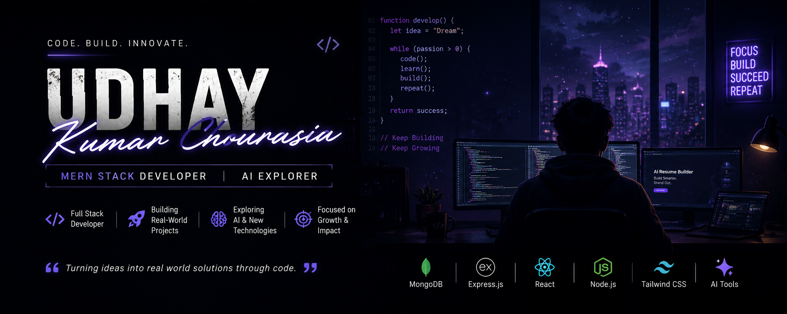

  

<h1 align="center">Hi 👋, I'm Udhay Kumar Chourasia</h1>

<h3 align="center">🚀 MERN Stack Developer | AI Explorer | CSE Student</h3>

  

---

## 👨‍💻 About Me

- 🚀 MERN Stack Developer
- 💻 Building Real-World Web + AI Projects
- 🌱 Exploring AI & Modern Technologies
- ⚡ Learning, Building & Growing Daily
- 🔥 Passionate About Development & Creativity

---

## 🚀 Tech Stack

---

## 📊 GitHub Stats

---

## 🧠 Currently Exploring

- 🤖 AI + Prompt Engineering
- ⚡ MERN Stack Development
- 🌐 Scalable Web Applications
- 🎨 Modern UI / UX

---

## 🔥 Featured Project

# 🚀 AI Resume Builder

✨ AI-powered Resume Builder using MERN Stack with authentication, dashboard and modern UI.

🔗 **Live Demo:**  
https://ai-resume-builder-xi-bay.vercel.app/#

💻 **GitHub Repo:**  
https://github.com/Udaychourasia/AI-resume-builder

---

## 🌐 Connect With Me

---

<h3 align="center">⚡ Turning Ideas Into Real-World Code ⚡</h3>
